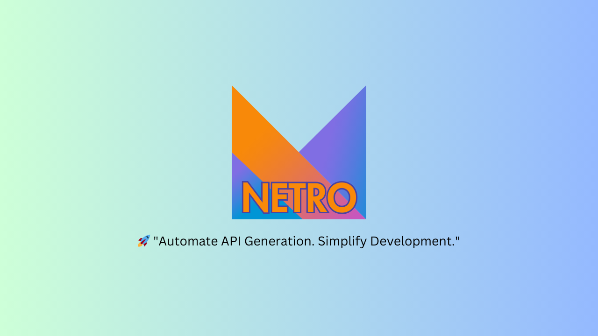

# Netro Gradle Plugin

**Netro** is a Gradle plugin that automates the generation of Retrofit API interfaces and Kotlin data models using JSON configuration files. It simplifies API integration in Kotlin projects by eliminating the need for manually writing API service interfaces and data models.

## Features 🚀

- **Automatic API Service Generation**: Converts JSON configurations into Retrofit API interfaces.
- **Model Class Generation**: Generates Kotlin data classes using KotlinPoet and Kotlin Serialization.
- **Supports Multiple HTTP Methods**: GET, POST, PUT, DELETE are handled seamlessly.
- **Organized Code Structure**:
    - API services and models are structured into separate packages.
    - Naming conventions ensure maintainability.
- **Easy Integration**: Can be applied as a Gradle plugin in any Kotlin project.

---

## Demo Video
[](https://www.youtube.com/watch?v=5ilWAYKV0pg&t=1s)

## Installation 📦

### 1. Apply the Plugin
Then, apply the plugin in your **`build.gradle.kts`**:

```kotlin
plugins {
    id("com.github.probelalkhan.netro") version "0.1"
}
```

### 2. Sync the Project
Run:
```sh
gradle sync
```

### 3. Add Configuration 
```kotlin
netroConfig {
    path = project.rootProject.layout.projectDirectory.dir("netro-configs").asFile.absolutePath
    packageAlias = android.namespace!!
}
```
You can customize the configuration as needed:
- **`path`**: The directory path where JSON configuration files are stored.
- **`packageAlias`**: The package name for generated API services and models.
---

## Usage 🛠

### 1. Create JSON Configuration File
Inside your project's resource directory, create a JSON file following the naming convention:

📁 `projectRoot/netro-configs/user_config.json`

```json
{
  "baseUrl": "https://dummyjson.com/",
  "endpoints": [
    {
      "name": "getUsers",
      "path": "/users",
      "method": "GET",
      "responseModel": "UserListResponse"
    },
    {
      "name": "getUserById",
      "path": "/users/{id}",
      "method": "GET",
      "responseModel": "User"
    }
  ],
  "models": {
    "User": {
      "id": "Int",
      "firstName": "String",
      "lastName": "String",
      "age": "Int",
      "gender": "String",
      "email": "String"
    },
    "UserListResponse": {
      "users": "List<User>",
      "total": "Int",
      "skip": "Int",
      "limit": "Int"
    }
  }
}
```

### 2. Run the Netro Plugin
Execute the following Gradle task to generate API service interfaces and model classes:

```sh
./gradlew netroSync
```

### 3. Generated Code Structure
After execution, Netro generates the following structure:

📂 `com.example.user`
- 📄 `UserApiService.kt` (Retrofit API Interface)
- 📂 `models`
    - 📄 `UserResponse.kt` (Response Model)
    - 📄 `CreateUserRequest.kt` (Request Model)

#### Example Generated API Service
```kotlin
public interface UsersApiService {
    @GET("/users")
    public suspend fun getUsers(): UserListResponse

    @GET("/users/{id}")
    public suspend fun getUserById(@Path("id") id: String): User
}
```

#### Example Generated Data Model
```kotlin
@Serializable
public data class UserListResponse(
    @SerialName("users")
    public val users: List<User>,
    @SerialName("total")
    public val total: Int,
    @SerialName("skip")
    public val skip: Int,
    @SerialName("limit")
    public val limit: Int,
)

@Serializable
public data class User(
    @SerialName("id")
    public val id: Int,
    @SerialName("firstName")
    public val firstName: String,
    @SerialName("lastName")
    public val lastName: String,
    @SerialName("age")
    public val age: Int,
    @SerialName("gender")
    public val gender: String,
    @SerialName("email")
    public val email: String,
)
```

---

## Advanced Configuration ⚙️

### Custom Package Naming
Netro automatically organizes API services into separate packages based on JSON filenames. Ensure your configuration file follows the naming convention:

```
{package_name}_config.json
```

Where:
- `{package_name}` is used as the package name.
- API services are generated inside `{package_name}`. [`{package_name}`+ApiService.kt]
- Data models are placed inside `{package_name}.models`.

### Handling Multiple APIs
You can define multiple JSON configurations for different API modules. Each file will generate a separate API service and models.

📁 `src/main/resources/api_config/order_config.json`
```json
{
  "package": "com.example.order",
  "baseUrl": "https://api.example.com",
  "endpoints": [
    {
      "name": "getOrder",
      "path": "/orders/{id}",
      "method": "GET",
      "response": "OrderResponse"
    }
  ]
}
```

This will generate:
📂 `com.example.order`
- 📄 `OrderApiService.kt`
- 📂 `models`
    - 📄 `OrderResponse.kt`

---

## Compatibility ✅

- **Kotlin**: 1.9+
- **Gradle**: 8.0+
- **Java**: 17+
- **Retrofit**: 2.x+
- **KotlinPoet**: 1.17+

---

## Contributing 🤝

Contributions are welcome! Feel free to fork the repo and submit a pull request.

1. Clone the repository:
   ```sh
   git clone https://github.com/probelalkhan/netro.git
   ```
2. Create a feature branch:
   ```sh
   git checkout -b feature-name
   ```
3. Commit changes:
   ```sh
   git commit -m "feat: Add new feature"
   ```
4. Push to the branch:
   ```sh
   git push origin feature-name
   ```
5. Create a pull request.

---

## License 📜

Netro is licensed under the **MIT License**. See [LICENSE](LICENSE) for details.

---

## Author ✨

Developed by [Belal Khan](https://github.com/probelalkhan)

---

## Tags 🏷️

`gradle-plugin` `retrofit` `kotlin` `api-generator` `json-to-kotlin` `kotlinpoet` `code-generation` `serialization`

---

## Support 💡

If you find this plugin useful, consider giving it a ⭐ on [GitHub](https://github.com/probelalkhan/netro)!

Happy Coding! 🚀

